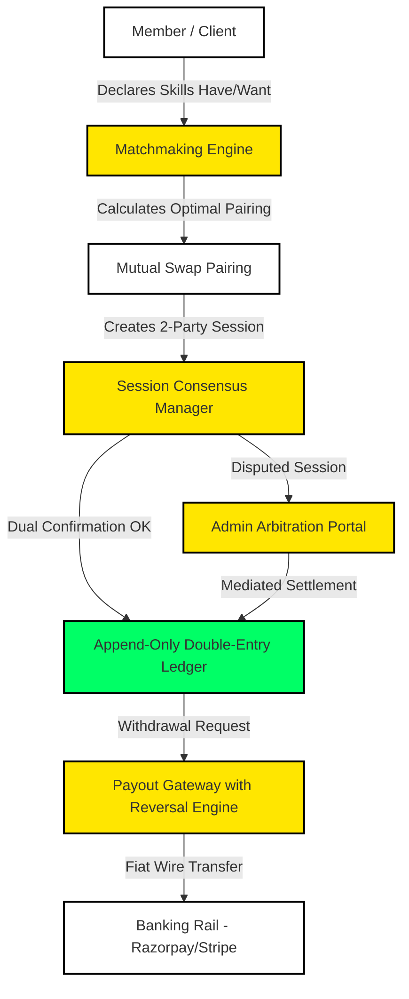
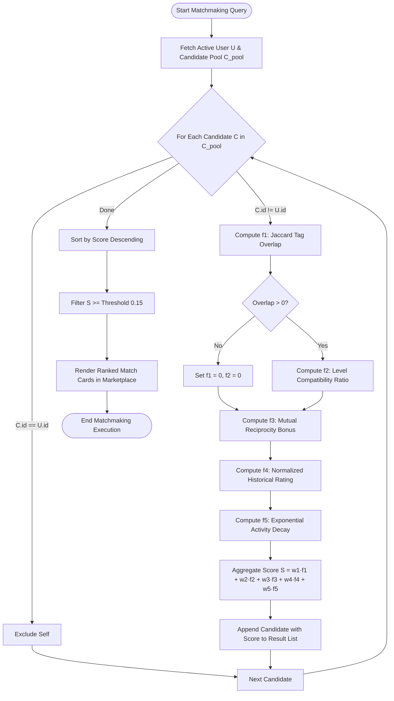
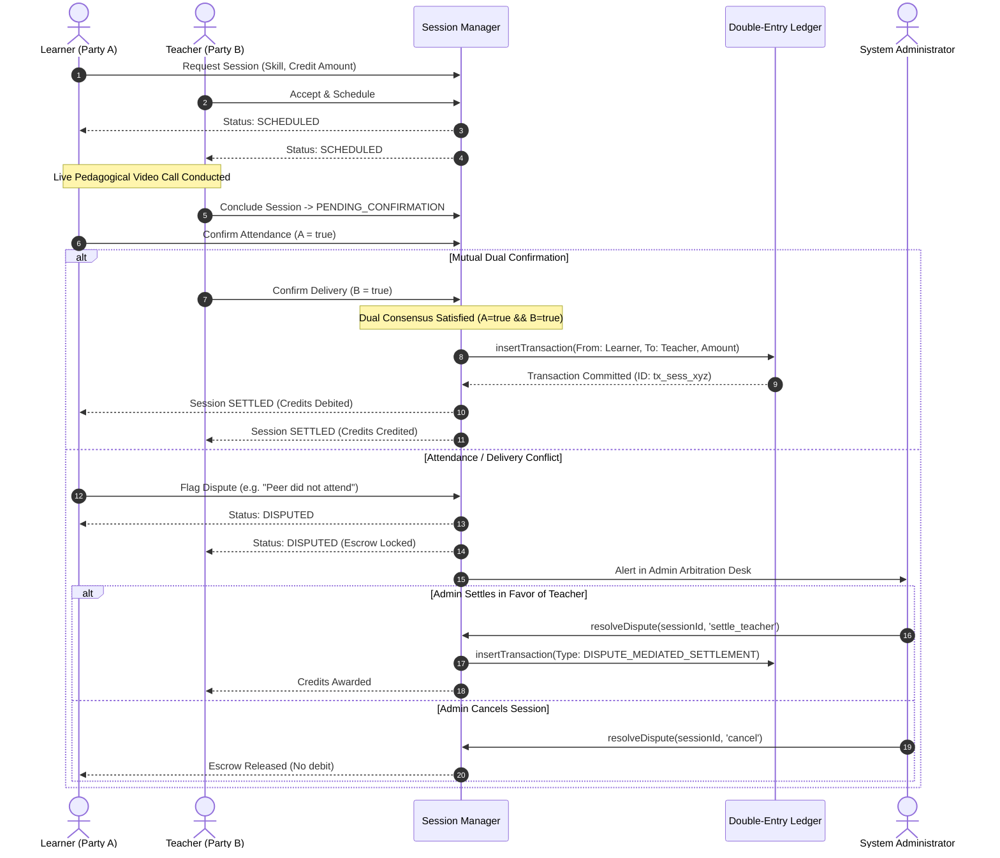
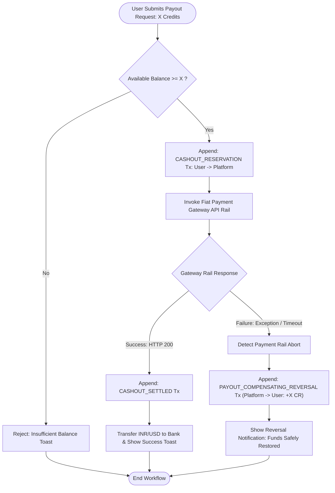
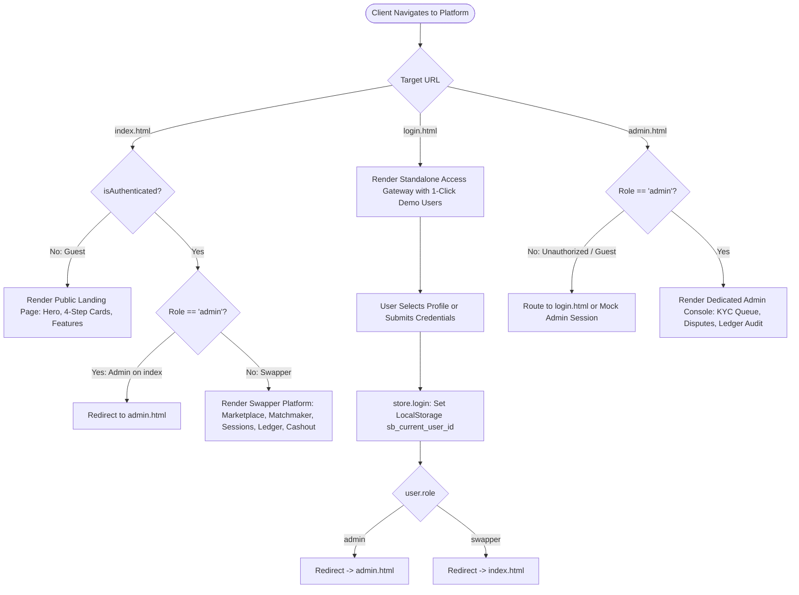

# Skill Badlu — Formal Algorithms, State Machines & Flowcharts Specification

**Version:** 4.4.0  
**Status:** Production Standard  
**System Reference:** [docs/architecture/system-design.md](file:///d:/SKILL%20BADLU/docs/architecture/system-design.md)  
**Authors:** Google Antigravity Advanced Agentic Coding Team

---

## Table of Contents

1. [Executive Architectural Summary](#1-executive-architectural-summary)
2. [Algorithm 1: Multi-Factor Rule-Based Matchmaking Engine](#2-algorithm-1-multi-factor-rule-based-matchmaking-engine)
3. [Algorithm 2: Double-Entry Ledger & Platform Solvency Invariant](#3-algorithm-2-double-entry-ledger--platform-solvency-invariant)
4. [Algorithm 3: Dual-Party Session Consensus & Dispute Lifecycle](#4-algorithm-3-dual-party-session-consensus--dispute-lifecycle)
5. [Algorithm 4: Fiat Payout Protocol & Automated Compensating Reversals](#5-algorithm-4-fiat-payout-protocol--automated-compensating-reversals)
6. [Algorithm 5: Three-Tier Role-Based Routing & Access Gateway](#6-algorithm-5-three-tier-role-based-routing--access-gateway)

---

## 1. Executive Architectural Summary

**Skill Badlu** is an immutable, peer-to-peer (P2P) skill-exchange marketplace governed by:

- **Zero Commission Barter:** Members exchange pedagogical hours without platform cuts.
- **Cryptographic Solvency:** A strictly append-only double-entry ledger where currency is never modified in-place; all balances are deterministically derived via transaction aggregation.
- **Role Isolation:** Total separation between Public Guests, Verified Swappers, and System Administrators across dedicated interfaces (`index.html`, `login.html`, `admin.html`).



---

## 2. Algorithm 1: Multi-Factor Rule-Based Matchmaking Engine

### 2.1 Mathematical Formulation

For an active query user $U$ and candidate peer $C$, the affinity compatibility score $S(C, U) \in [0.0, 1.0]$ is defined as:

$$S(C, U) = \sum_{i=1}^{5} w_i \cdot f_i(C, U)$$

Subject to the convexity constraint:
$$\sum_{i=1}^{5} w_i = 1.0 \quad \text{where } w_i \ge 0$$

Default engine parameters:
$$w = [w_1=0.30, w_2=0.15, w_3=0.35, w_4=0.10, w_5=0.10]$$

#### Component Scoring Functions:

1. **Skill Tag Overlap ($f_1$ - Jaccard Index):**
   Evaluates how well candidate's offered skills ($C_{have}$) fulfill user's desired skills ($U_{want}$):
   $$f_1(C, U) = \frac{|C_{have} \cap U_{want}|}{|C_{have} \cup U_{want}|}$$

2. **Skill Level Compatibility ($f_2$):**
   For intersecting skills $K = C_{have} \cap U_{want}$, verifies whether candidate's proficiency meets user expectations:
   $$f_2(C, U) = \frac{1}{|K|} \sum_{k \in K} \begin{cases} 1.0 & \text{if } Level(C, k) \ge Level(U, k) \\ 0.5 & \text{if } Level(C, k) < Level(U, k) \end{cases}$$
   _(If $K = \emptyset$, then $f_2 = 0.0$)_

3. **Mutual Reciprocity Bonus ($f_3$):**
   Rewards direct reciprocal barter where active user also offers a skill the candidate wants:
   $$f_3(C, U) = \begin{cases} 1.0 & \text{if } |U_{have} \cap C_{want}| > 0 \\ 0.0 & \text{otherwise} \end{cases}$$

4. **Historical Peer Rating ($f_4$):**
   Linear normalization of peer review average $R \in [1.0, 5.0]$:
   $$f_4(C, U) = \max\left(0.0, \min\left(1.0, \frac{Rating(C) - 1.0}{4.0}\right)\right)$$

5. **Activity Recency Decay ($f_5$):**
   Exponential half-life decay based on elapsed hours since candidate's last activity $\Delta t$:
   $$f_5(C, U) = \exp(-\lambda \cdot \Delta t) \quad \text{where } \lambda = \frac{\ln(2)}{168 \text{ hours}}$$

---

### 2.2 Matchmaking Flowchart



---

## 3. Algorithm 2: Double-Entry Ledger & Platform Solvency Invariant

### 3.1 Mathematical Formulations

1. **Append-Only Journal:**
   Every credit transfer $T_k$ is an immutable tuple:
   $$T_k = \langle id, \text{sessionId}, \text{fromUser}, \text{toUser}, \text{amount}, \text{type}, \text{timestamp} \rangle$$
   _No database `UPDATE` or `DELETE` operations are ever executed on transactions._

2. **Derived Wallet Balance:**
   User balance $Balance(u)$ is derived purely from transaction history:
   $$Balance(u) = \sum_{t \in T, t.\text{to}=u} t.\text{amount} - \sum_{t \in T, t.\text{from}=u} t.\text{amount}$$

3. **Platform Solvency Invariant ($\Delta = 0$):**
   The total minted credits issued by the platform treasury must strictly equal total user balances plus cashed-out fiat credits:
   $$\sum_{t \in T, t.\text{from}=\text{TREASURY}} t.\text{amount} = \sum_{u \in Users} Balance(u) + \sum_{t \in T, t.\text{to}=\text{CASHOUT}} t.\text{amount}$$
   $$\text{Solvency Discrepancy } \Delta = TotalMinted - (TotalWalletBalances + TotalCashedOut) = 0$$

---

### 3.2 Double-Entry Ledger Verification Flowchart

```mermaid
flowchart TD
    Trigger([Audit Verification Triggered]) --> FetchAll[Fetch All Immutable Transactions T & Users U]
    FetchAll --> InitSums[Initialize TotalMinted = 0, TotalCashed = 0, WalletSum = 0]

    InitSums --> ScanTx{For Each Transaction t in T}
    ScanTx -->|t.from == TREASURY| AddMinted[TotalMinted += t.amount] --> NextTx
    ScanTx -->|t.to == CASHOUT| AddCashed[TotalCashed += t.amount] --> NextTx
    ScanTx -->|Peer-to-Peer| PassTx[Internal Peer Transfer] --> NextTx
    NextTx --> ScanTx

    ScanTx -->|Completed| ScanUsers{For Each User u in U}
    ScanUsers --> DeriveBal["Compute Balance(u) = Sum(Credits) - Sum(Debits)"]
    DeriveBal --> AddWalletSum[WalletSum += Balance(u)]
    AddWalletSum --> NextUser[Next User] --> ScanUsers

    ScanUsers -->|Completed| CheckDelta{"Compute Discrepancy: Δ = TotalMinted - (WalletSum + TotalCashed)"}

    CheckDelta -->|Δ == 0| AuditPass[Mark Status: 100% SOLVENT & RECONCILED]
    CheckDelta -->|Δ != 0| AuditFail[Trigger Circuit Breaker & Flag Discrepancy Alert]

    AuditPass --> RenderModal[Display Solvency Proof Modal & Breakdown]
    AuditFail --> LogAudit[Log Cryptographic Discrepancy Hash to Admin Console]
    RenderModal --> FinishAudit([Audit Completed])
    LogAudit --> FinishAudit
```

---

## 4. Algorithm 3: Dual-Party Session Consensus & Dispute Lifecycle

### 4.1 State Transition Matrix

The session state machine enforces a non-reversible dual-consensus lifecycle:

```
[REQUESTED] ──(Learner & Teacher Agree)──> [SCHEDULED]
     │
     └──(Time Reached)──> [IN_PROGRESS]
                              │
  ┌───────────────────────────┴───────────────────────────┐
  ▼                                                       ▼
[PENDING_CONFIRMATION]                              [DISPUTED]
  │ (A confirms & B confirms)                             │ (Admin Intervention)
  ▼                                           ┌───────────┴───────────┐
[SETTLED]                                     ▼                       ▼
(Ledger Atomically Credited)         [SETTLE_TEACHER]         [CANCEL_REFUND]
                                    (Award to Teacher)     (Revert to Learner)
```

---

### 4.2 Sequence Diagram: 2-Party Consensus to Atomic Ledger Settlement



---

## 5. Algorithm 4: Fiat Payout Protocol & Automated Compensating Reversals

### 5.1 Saga Pattern Implementation

In distributed financial workflows, state mutations must never be silently dropped upon rail failure. Skill Badlu implements the **Saga Compensating Reversal** pattern:

1. **Step 1 (Debit):** `CASHOUT_RESERVATION` debits the user's available credits and transfers them into platform escrow.
2. **Step 2 (Gateway Attempt):** External banking rail (e.g. Razorpay/Stripe transfer API) is invoked.
3. **Step 3A (Success):** If rail returns `200 OK`, transaction is finalized as `CASHOUT_SETTLED`.
4. **Step 3B (Failure / Timeout):** If rail returns error, an equal-and-opposite `PAYOUT_COMPENSATING_REVERSAL` transaction is atomically appended to the ledger, restoring user balance without modifying or deleting history.

---

### 5.2 Compensating Reversal Flowchart



---

## 6. Algorithm 5: Three-Tier Role-Based Routing & Access Gateway

### 6.1 Unified Authentication State Machine

The platform isolates audiences into three mutually exclusive security domains:

| State              | Storage Key (`sb_current_user_id`) | Role      | Accessible View                                                         | Restricted Views                                                |
| :----------------- | :--------------------------------- | :-------- | :---------------------------------------------------------------------- | :-------------------------------------------------------------- |
| **Guest / Public** | `null`                             | `guest`   | `index.html` (Landing View: Hero, Features, How It Works, Sign In/Up)   | Platform Dashboard, Admin Portal                                |
| **Swapper**        | `user_a` / `user_b` / `user_c`     | `swapper` | `index.html` (Marketplace, Matchmaker, Sessions, Ledger, Cashout)       | Admin Portal (`admin.html`)                                     |
| **Administrator**  | `user_admin`                       | `admin`   | `admin.html` (Admin Desk, KYC Queue, Dispute Arbitration, Ledger Audit) | Swapper Navigation (`index.html` auto-forwards to `admin.html`) |

---

### 6.2 Role Routing Flowchart



---

## 7. Verification Invariant Summary Table

| Invariant                      | Mathematical Check                                    | Implementation File                                           | Verification Test                            |
| :----------------------------- | :---------------------------------------------------- | :------------------------------------------------------------ | :------------------------------------------- |
| **Match Score Boundedness**    | $0.0 \le S(C, U) \le 1.0$                             | [js/matchmaker.js](file:///d:/SKILL%20BADLU/js/matchmaker.js) | Slider stress test $w_1..w_5 \in [0, 1]$     |
| **Double-Entry Solvency**      | $\Delta = TotalMinted - (Balances + Cashed) = 0$      | [js/ledger.js](file:///d:/SKILL%20BADLU/js/ledger.js)         | `ledger.reconcile().isVerified === true`     |
| **Session State Immutability** | $State_{prev} \le State_{curr}$ (No back-transitions) | [js/sessions.js](file:///d:/SKILL%20BADLU/js/sessions.js)     | Disallow re-scheduling of settled sessions   |
| **Compensating Consistency**   | $Bal_{after\_fail} == Bal_{initial}$                  | [js/payouts.js](file:///d:/SKILL%20BADLU/js/payouts.js)       | Simulate gateway failure toggle check        |
| **Strict View Isolation**      | Admin view has zero swapper tabs                      | [admin.html](file:///d:/SKILL%20BADLU/admin.html)             | `scripts/verify_isolation.py` (15/15 passed) |

---

_End of Technical Specification — Skill Badlu Architecture Documentation_
