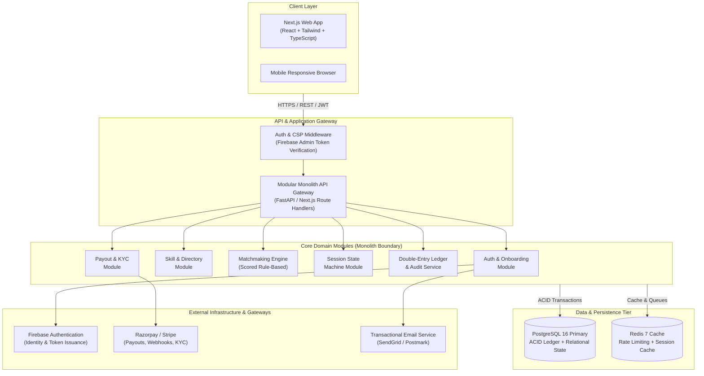
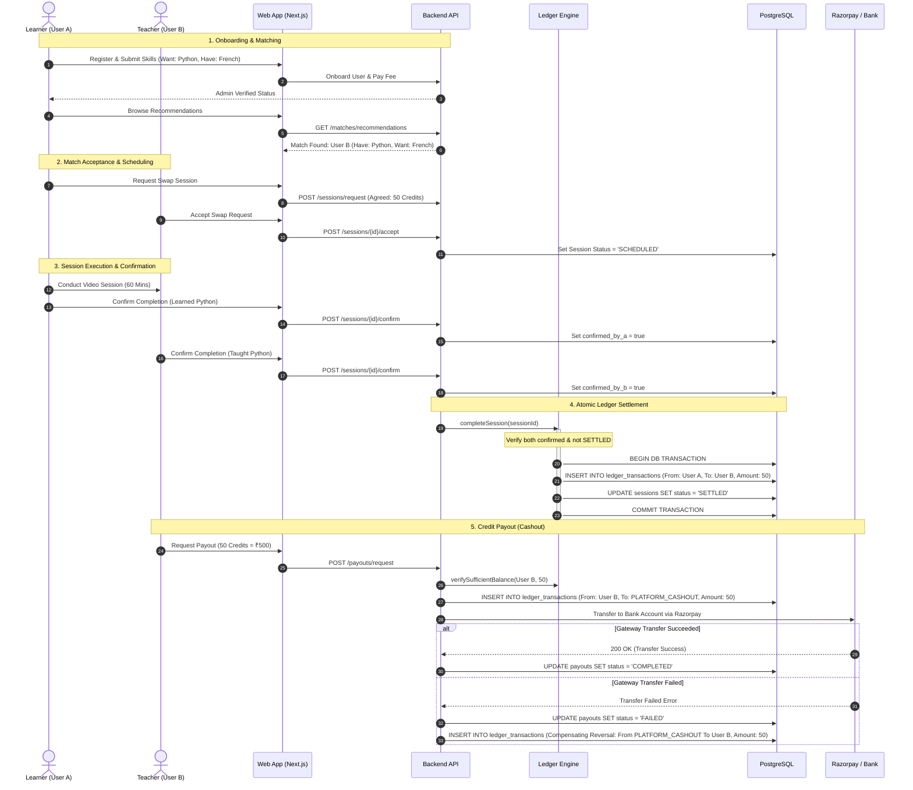
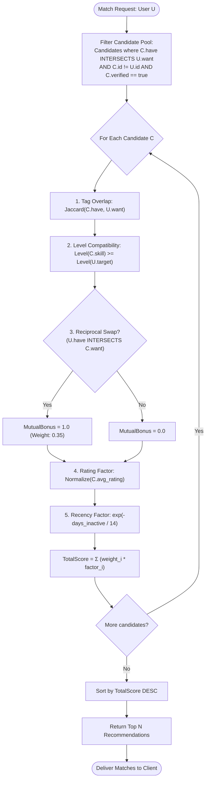
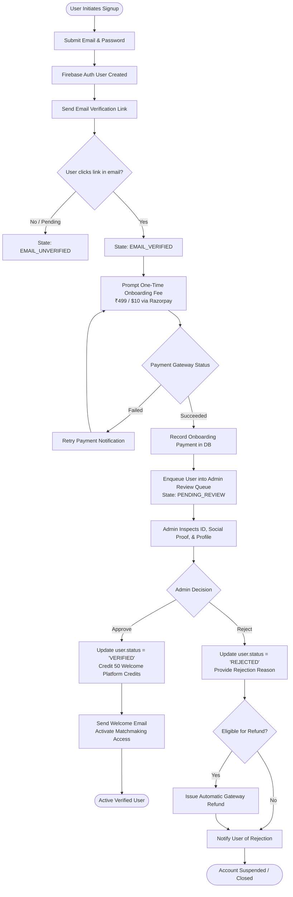
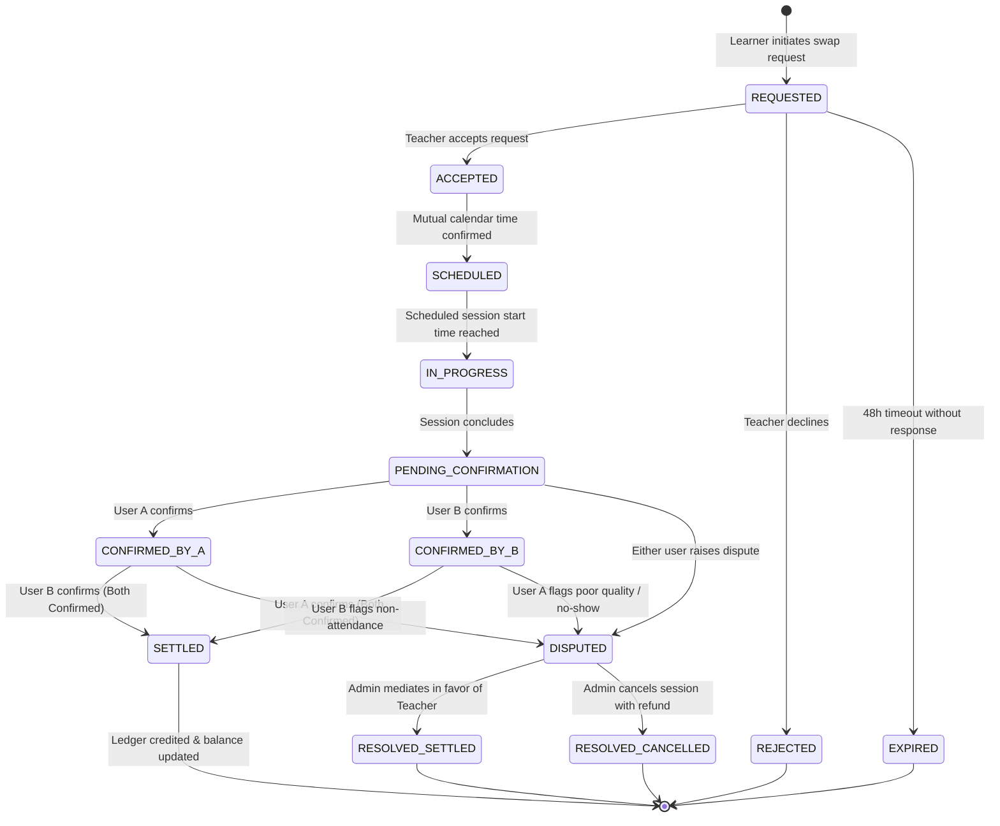
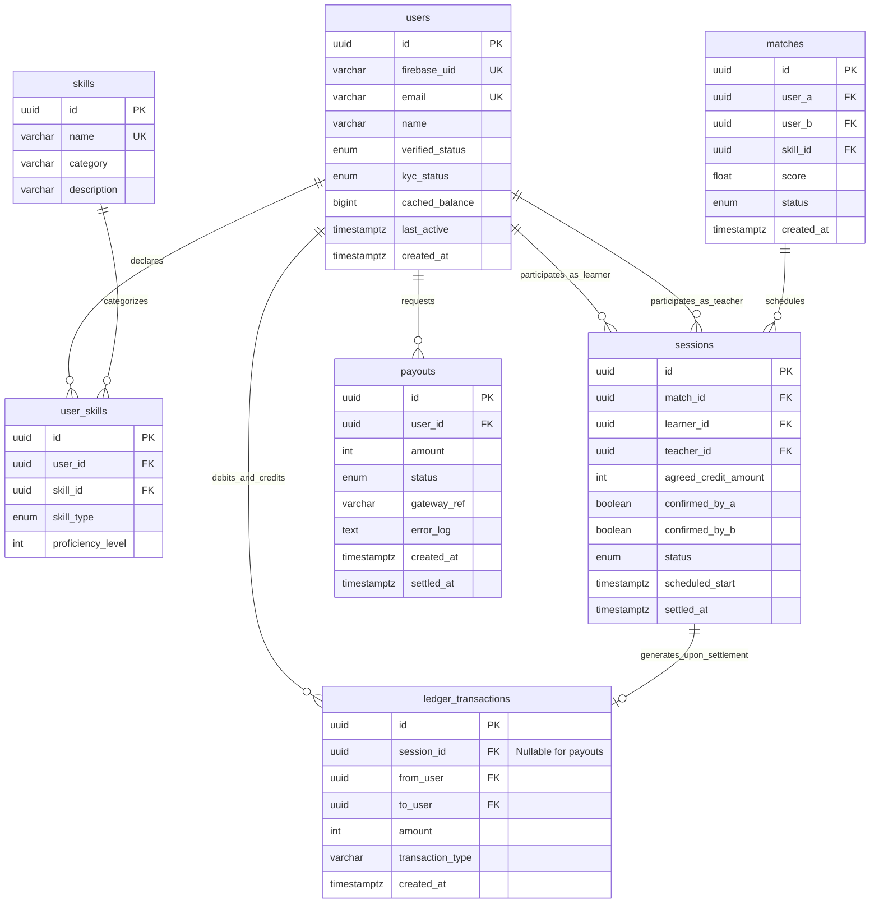

# Skill Badlu — System Architecture & Design Document

**Status:** Proposed  
**Date:** 2026-09-05  
**Deciders:** Founding & Engineering Team  
**System:** Skill Badlu (Peer-to-Peer Skill-Swap Marketplace)  
**Related Documents:** [ADR 0001: Firebase Auth + FastAPI + PostgreSQL](../adr/0001-firebase-auth-fastapi-postgresql.md) | [Token Revocation Runbook](../runbooks/token-revocation-runbook.md)

---

## 1. Context and Executive Summary

**Skill Badlu** is a decentralized, peer-to-peer skill-exchange marketplace designed to remove financial friction from continuous learning. Users list skills they possess (*Have*) and skills they wish to learn (*Want*), are matched with complementary peers, schedule teach/learn sessions, and earn platform credits recorded in an immutable, auditable financial ledger. Credits earned can subsequently be redeemed for sessions with other tutors or cashed out as fiat currency.

### 1.1 Core Business Principles
1. **Reciprocal Value Creation:** Every user is simultaneously a learner and an educator.
2. **Financial Ledger Integrity:** Credits represent real monetary liability. The ledger is treated with banking-grade immutability—never updated, never deleted.
3. **Trust & Verification:** Sybil resistance is established via upfront verification, identity screening, and two-party cryptographic session confirmations.

---

## 2. System Requirements & Design Constraints

### 2.1 Functional Requirements
- **User Onboarding & Verification:** Multi-stage funnel (Signup $\rightarrow$ Email Verification $\rightarrow$ One-time Onboarding Fee $\rightarrow$ Admin Review Queue $\rightarrow$ Active).
- **Skill Taxonomy & Profiles:** Categorized directory (Technology, Languages, Arts & Crafts, Business, Academics) with proficiency self-assessment (Beginner, Intermediate, Advanced, Expert).
- **Matchmaking Engine:** Rule-based algorithm calculating affinity scores based on mutual skill overlap, reciprocal interest, ratings, and activity recency.
- **Session Lifecycle & Two-Way Confirmation:** Calendar scheduling, off-platform or embedded video calls, and dual-party confirmation required for credit settlement.
- **Append-Only Credit Ledger:** Double-entry, audit-traceable accounting system with zero platform commission at MVP.
- **Fiat Payout Pipeline:** KYC verification coupled with Razorpay/Stripe payout dispatch and automated compensating ledger reversals on failure.
- **Admin Moderation Portal:** Verification queue management, dispute mediation, and ledger reconciliation auditing.

### 2.2 Non-Functional Requirements
- **Integrity Over Speed:** Financial correctness is paramount. Ledger writes must execute in strictly isolated ACID transactions.
- **Deterministic Auditability:** Every credit transaction must link directly to an approved session ID or platform payout ID.
- **Horizontal Scalability:** Modular monolith architecture capable of supporting 5,000+ Daily Active Users (DAU) on single-node managed PostgreSQL before requiring service extraction.
- **Fraud & Collusion Resistance:** Single-party self-minting is mathematically prevented by two-way state confirmation and idempotency keys.

---

## 3. High-Level Architecture

The system is organized as a **Modular Monolith** to maximize engineering velocity and simplify transactional boundaries during early traction.



---

## 4. End-to-End User Journey Flowchart



---

## 5. Deep Dive: Core Algorithms & Mechanics

### 5.1 Append-Only Double-Entry Credit Ledger

The credit ledger represents financial balances and platform liability. **No rows in `ledger_transactions` may ever be updated or deleted.**

#### Balance Derivation Formula
A user's balance is computed deterministically from the immutable audit log:

$$\text{Balance}(u) = \sum_{t \in T, \text{to\_user} = u} \text{amount}(t) - \sum_{t \in T, \text{from\_user} = u} \text{amount}(t)$$

#### Ledger Settlement Flowchart

```mermaid
flowchart TD
    Start([Session Completion Triggered]) --> CheckStatus{Session status<br/>already SETTLED?}
    CheckStatus -- Yes --> ReturnIdempotent[Return 200 OK<br/>Idempotent No-Op]
    CheckStatus -- No --> CheckA{confirmed_by_a<br/>== true?}
    
    CheckA -- No --> WaitB[Update confirmed_by_b = true<br/>Status: PENDING_CONFIRMATION]
    CheckA -- Yes --> CheckB{confirmed_by_b<br/>== true?}
    
    CheckB -- No --> WaitA[Update confirmed_by_a = true<br/>Status: PENDING_CONFIRMATION]
    CheckB -- Yes --> BeginTx[BEGIN DB TRANSACTION<br/>Isolation: SERIALIZABLE / REPEATABLE READ]
    
    BeginTx --> LockSession[SELECT * FROM sessions<br/>WHERE id = :id FOR UPDATE]
    LockSession --> RecheckSettled{Status == SETTLED?}
    RecheckSettled -- Yes --> RollbackTx[ROLLBACK TRANSACTION]
    RecheckSettled -- No --> InsertLedger[INSERT INTO ledger_transactions<br/>from_user = learner_id<br/>to_user = teacher_id<br/>amount = agreed_credits<br/>session_id = session.id]
    
    InsertLedger --> UpdateSession[UPDATE sessions<br/>SET status = 'SETTLED',<br/>settled_at = NOW()]
    UpdateSession --> CommitTx[COMMIT TRANSACTION]
    
    CommitTx --> InvalidateCache[Invalidate Redis Cached Balance<br/>DEL cache:balance:user_a<br/>DEL cache:balance:user_b]
    InvalidateCache --> NotifyUsers[Dispatch Push / Email Notifications]
    NotifyUsers --> Done([End])
    RollbackTx --> ReturnIdempotent
```

#### Production Python Implementation (ACID Ledger Service)

```python
# app/services/ledger.py
from datetime import datetime, timezone
import uuid
from sqlalchemy import select, func, and_
from sqlalchemy.ext.asyncio import AsyncSession
from fastapi import HTTPException, status
from app.models.models import SessionModel, LedgerTransaction, SessionStatusEnum


class LedgerService:
    @staticmethod
    async def get_balance(db: AsyncSession, user_id: uuid.UUID) -> int:
        """
        Derives balance directly from the immutable double-entry ledger.
        Balance = SUM(incoming credits) - SUM(outgoing credits)
        """
        incoming_query = select(
            func.coalesce(func.sum(LedgerTransaction.amount), 0)
        ).where(LedgerTransaction.to_user == user_id)

        outgoing_query = select(
            func.coalesce(func.sum(LedgerTransaction.amount), 0)
        ).where(LedgerTransaction.from_user == user_id)

        credits_in = (await db.execute(incoming_query)).scalar() or 0
        credits_out = (await db.execute(outgoing_query)).scalar() or 0

        return credits_in - credits_out

    @staticmethod
    async def complete_session(db: AsyncSession, session_id: uuid.UUID) -> dict:
        """
        Executes atomic settlement of a completed session.
        Enforces idempotency and dual-party confirmation.
        """
        async with db.begin():
            # 1. Row-level lock on the session to serialize concurrent confirmations
            stmt = (
                select(SessionModel)
                .where(SessionModel.id == session_id)
                .with_for_update()
            )
            result = await db.execute(stmt)
            session = result.scalar_one_or_none()

            if not session:
                raise HTTPException(
                    status_code=status.HTTP_404_NOT_FOUND, detail="Session not found"
                )

            # Idempotency check: if already settled, exit cleanly
            if session.status == SessionStatusEnum.SETTLED:
                return {
                    "status": "already_settled",
                    "session_id": str(session.id),
                }

            # Two-party confirmation check
            if not (session.confirmed_by_a and session.confirmed_by_b):
                raise HTTPException(
                    status_code=status.HTTP_400_BAD_REQUEST,
                    detail="Session requires two-way confirmation before settlement.",
                )

            # 2. Append-only ledger insert
            tx = LedgerTransaction(
                id=uuid.uuid4(),
                session_id=session.id,
                from_user=session.learner_id,
                to_user=session.teacher_id,
                amount=session.agreed_credit_amount,
                transaction_type="SESSION_SETTLEMENT",
                created_at=datetime.now(timezone.utc),
            )
            db.add(tx)

            # 3. Transition session status
            session.status = SessionStatusEnum.SETTLED
            session.settled_at = datetime.now(timezone.utc)

        # 4. Invalidate read caches outside transaction
        # redis_client.delete(f"cache:balance:{session.learner_id}")
        # redis_client.delete(f"cache:balance:{session.teacher_id}")

        return {
            "status": "settled",
            "transaction_id": str(tx.id),
            "amount": tx.amount,
        }
```

---

### 5.2 Matchmaking Algorithm (Rule-Based Weighted Scoring $\rightarrow$ Phase 2 ML)

The Phase 1 matchmaking algorithm uses deterministic, explainable multi-factor scoring.

#### Scoring Formula

$$\text{TotalScore}(C, U) = w_1 \cdot O(C, U) + w_2 \cdot L(C, U) + w_3 \cdot M(C, U) + w_4 \cdot R(C) + w_5 \cdot A(C)$$

Where:
- **$O(C, U)$ [Skill Overlap]:** Jaccard overlap coefficient between Candidate skills have ($C_{\text{have}}$) and User skills want ($U_{\text{want}}$).
  $$O(C, U) = \frac{|C_{\text{have}} \cap U_{\text{want}}|}{|C_{\text{have}} \cup U_{\text{want}}|}$$
- **$L(C, U)$ [Level Compatibility]:** Distance between teacher skill level and learner target level. Score is 1.0 if teacher level $\ge$ learner desired level; penalty is applied if teacher level $<$ learner level.
- **$M(C, U)$ [Mutual Swap Bonus]:** High-weight binary bonus (1.0 or 0.0) applied when Candidate also desires at least one skill User offers ($U_{\text{have}} \cap C_{\text{want}} \ne \emptyset$). This incentivizes reciprocal zero-cash swaps.
- **$R(C)$ [User Rating]:** Normalized peer rating in the range $[0.0, 1.0]$ ($\frac{\text{Rating} - 1}{4}$).
- **$A(C)$ [Recency Bonus]:** Exponential activity decay:
  $$A(C) = \exp\left(-\frac{\Delta t_{\text{days}}}{14}\right)$$

#### Weight Distribution (Tuned for Reciprocal Swaps)
| Weight | Parameter | Value | Rationale |
| :--- | :--- | :--- | :--- |
| $w_1$ | Skill Tag Overlap | **0.30** | Candidate must teach what the user desires. |
| $w_2$ | Level Compatibility | **0.15** | Prevents beginner teaching advanced topics. |
| $w_3$ | Mutual Swap Bonus | **0.35** | **Primary driver:** 2-way swaps maintain ledger equilibrium. |
| $w_4$ | Historical Rating | **0.10** | Rewards proven tutor quality. |
| $w_5$ | Activity Recency | **0.10** | Prioritizes responsive, active community members. |

#### Matchmaking Flowchart



#### Production Python Implementation (Matchmaking Engine)

```python
# app/services/matchmaker.py
from dataclasses import dataclass
import datetime
import math
from typing import List, Set


@dataclass
class UserProfile:
    user_id: str
    skills_have: Set[str]
    skills_want: Set[str]
    skill_levels: dict[str, int]  # 1: Beginner, 2: Intermediate, 3: Advanced, 4: Expert
    avg_rating: float  # 1.0 - 5.0
    last_active: datetime.datetime


class MatchmakingEngine:
    W1_OVERLAP = 0.30
    W2_LEVEL = 0.15
    W3_MUTUAL = 0.35
    W4_RATING = 0.10
    W5_RECENCY = 0.10

    @classmethod
    def score_candidate(
        cls, candidate: UserProfile, target_user: UserProfile
    ) -> float:
        # 1. Skill Overlap (Jaccard on C.have vs U.want)
        intersect = candidate.skills_have.intersection(target_user.skills_want)
        union = candidate.skills_have.union(target_user.skills_want)
        overlap_score = len(intersect) / len(union) if union else 0.0

        # 2. Level Compatibility
        # Ensure candidate is at or above target user's required level
        level_scores = []
        for skill in intersect:
            cand_lvl = candidate.skill_levels.get(skill, 1)
            user_lvl = target_user.skill_levels.get(skill, 1)
            level_scores.append(1.0 if cand_lvl >= user_lvl else 0.5)
        level_compat = (
            sum(level_scores) / len(level_scores) if level_scores else 0.0
        )

        # 3. Mutual Swap Bonus (Does target user teach what candidate wants?)
        mutual_overlap = target_user.skills_have.intersection(
            candidate.skills_want
        )
        mutual_bonus = 1.0 if len(mutual_overlap) > 0 else 0.0

        # 4. Rating Factor (Normalized 0.0 - 1.0)
        rating_score = max(0.0, min(1.0, (candidate.avg_rating - 1.0) / 4.0))

        # 5. Recency Bonus (Decay over 14 days)
        now = datetime.datetime.now(datetime.timezone.utc)
        delta_days = max(0.0, (now - candidate.last_active).total_seconds() / 86400.0)
        recency_score = math.exp(-delta_days / 14.0)

        # Composite score calculation
        total_score = (
            (cls.W1_OVERLAP * overlap_score)
            + (cls.W2_LEVEL * level_compat)
            + (cls.W3_MUTUAL * mutual_bonus)
            + (cls.W4_RATING * rating_score)
            + (cls.W5_RECENCY * recency_score)
        )
        return round(total_score, 4)

    @classmethod
    def rank_matches(
        cls, target_user: UserProfile, candidates: List[UserProfile], top_n: int = 20
    ) -> List[tuple[UserProfile, float]]:
        scored = []
        for cand in candidates:
            if cand.user_id == target_user.user_id:
                continue
            # Fast filter: must have at least one wanted skill
            if not cand.skills_have.intersection(target_user.skills_want):
                continue
            score = cls.score_candidate(cand, target_user)
            scored.append((cand, score))

        scored.sort(key=lambda x: x[1], reverse=True)
        return scored[:top_n]
```

---

### 5.3 User Onboarding & Admin Approval Flowchart



---

### 5.4 Payout Algorithm with Compensating Reversal

When a user converts accrued credits to fiat currency, the system must guarantee that a payment gateway network partition or failure does not result in lost or orphaned credits.

#### Payout Flowchart

```mermaid
flowchart TD
    ReqPayout([User Requests Payout]) --> CheckKYC{User kyc_status<br/>== 'VERIFIED'?}
    CheckKYC -- No --> RejectKYC[Return 403 Forbidden<br/>KYC Verification Required]
    
    CheckKYC -- Yes --> CheckBalance{Ledger.getBalance(u)<br/>>= requested_amount?}
    CheckBalance -- No --> RejectBalance[Return 400 Bad Request<br/>Insufficient Available Credits]
    
    CheckBalance -- Yes --> BeginTx[BEGIN DB TRANSACTION]
    BeginTx --> InsertPayout[INSERT INTO payouts<br/>status = 'PENDING'<br/>user_id = u.id, amount = amount]
    InsertPayout --> InsertDebit[INSERT INTO ledger_transactions<br/>from_user = u.id<br/>to_user = 'PLATFORM_CASHOUT'<br/>amount = amount<br/>type = 'PAYOUT_RESERVATION']
    InsertDebit --> CommitTx[COMMIT DB TRANSACTION]
    
    CommitTx --> CallGateway[Dispatch Gateway API Request<br/>RazorpayX / Stripe Payouts API]
    
    CallGateway --> GatewayResult{Gateway HTTP Status}
    
    GatewayResult -- 200 Success --> PayoutSuccess[UPDATE payouts<br/>SET status = 'COMPLETED',<br/>gateway_ref = response.id]
    PayoutSuccess --> NotifySuccess[Send Payout Confirmation Email]
    NotifySuccess --> DoneSuccess([Payout Finalized])
    
    GatewayResult -- Error / Failure --> PayoutFailed[UPDATE payouts<br/>SET status = 'FAILED',<br/>error_log = response.error]
    PayoutFailed --> CompensatingTx[INSERT INTO ledger_transactions<br/>from_user = 'PLATFORM_CASHOUT'<br/>to_user = u.id<br/>amount = amount<br/>type = 'PAYOUT_COMPENSATING_REVERSAL']
    CompensatingTx --> NotifyFailure[Notify User of Payout Failure<br/>Credits Restored to Balance]
    NotifyFailure --> DoneFailure([End with Audit Trail Intact])
```

#### Production Python Implementation (Payout Engine)

```python
# app/services/payout.py
import uuid
from datetime import datetime, timezone
from sqlalchemy import select
from sqlalchemy.ext.asyncio import AsyncSession
from fastapi import HTTPException, status
from app.models.models import PayoutModel, LedgerTransaction, UserModel, PayoutStatusEnum
from app.services.ledger import LedgerService

PLATFORM_CASHOUT_ACCOUNT = uuid.UUID("00000000-0000-0000-0000-000000000001")

class PayoutService:
    @staticmethod
    async def request_payout(
        db: AsyncSession, 
        user_id: uuid.UUID, 
        amount: int, 
        gateway_client
    ) -> dict:
        # 1. Verification of KYC
        user_stmt = select(UserModel).where(UserModel.id == user_id)
        user = (await db.execute(user_stmt)).scalar_one_or_none()
        if not user or user.kyc_status != "VERIFIED":
            raise HTTPException(
                status_code=status.HTTP_403_FORBIDDEN,
                detail="User must have verified KYC to request cash payouts."
            )

        # 2. Derive live balance directly from the ledger
        available_balance = await LedgerService.get_balance(db, user_id)
        if available_balance < amount:
            raise HTTPException(
                status_code=status.HTTP_400_BAD_REQUEST,
                detail=f"Insufficient credits. Requested: {amount}, Available: {available_balance}"
            )

        # 3. Reserve funds within atomic DB transaction
        payout_id = uuid.uuid4()
        async with db.begin():
            payout = PayoutModel(
                id=payout_id,
                user_id=user_id,
                amount=amount,
                status=PayoutStatusEnum.PENDING,
                created_at=datetime.now(timezone.utc)
            )
            db.add(payout)

            debit_tx = LedgerTransaction(
                id=uuid.uuid4(),
                session_id=None,
                from_user=user_id,
                to_user=PLATFORM_CASHOUT_ACCOUNT,
                amount=amount,
                transaction_type="PAYOUT_RESERVATION",
                created_at=datetime.now(timezone.utc)
            )
            db.add(debit_tx)

        # 4. Invoke external payment gateway API
        try:
            gateway_response = await gateway_client.create_transfer(
                account_details=user.bank_details,
                amount_in_cents=amount * 100,  # 1 Credit = 100 Cents / INR
                idempotency_key=str(payout_id)
            )
            
            # Succeeded: mark payout COMPLETED
            async with db.begin():
                payout_record = (await db.execute(select(PayoutModel).where(PayoutModel.id == payout_id))).scalar_one()
                payout_record.status = PayoutStatusEnum.COMPLETED
                payout_record.gateway_ref = gateway_response["id"]
                payout_record.settled_at = datetime.now(timezone.utc)

            return {"status": "success", "payout_id": str(payout_id), "gateway_ref": gateway_response["id"]}

        except Exception as gateway_err:
            # Failed: NEVER delete original debit; write COMPENSATING reversal entry
            async with db.begin():
                payout_record = (await db.execute(select(PayoutModel).where(PayoutModel.id == payout_id))).scalar_one()
                payout_record.status = PayoutStatusEnum.FAILED
                payout_record.error_log = str(gateway_err)

                reversal_tx = LedgerTransaction(
                    id=uuid.uuid4(),
                    session_id=None,
                    from_user=PLATFORM_CASHOUT_ACCOUNT,
                    to_user=user_id,
                    amount=amount,
                    transaction_type="PAYOUT_COMPENSATING_REVERSAL",
                    created_at=datetime.now(timezone.utc)
                )
                db.add(reversal_tx)

            raise HTTPException(
                status_code=status.HTTP_502_BAD_GATEWAY,
                detail=f"Payout transfer failed: {str(gateway_err)}. Reserved credits have been restored."
            )
```

---

### 5.5 Session State Transition Diagram



---

## 6. PostgreSQL Database Schema & Relational DDL



### Complete PostgreSQL 16 DDL Script

```sql
-- PostgreSQL 16 Schema Definition for Skill Badlu

CREATE EXTENSION IF NOT EXISTS "uuid-ossp";

-- Enumerations
CREATE TYPE user_verified_enum AS ENUM ('EMAIL_UNVERIFIED', 'EMAIL_VERIFIED', 'PENDING_REVIEW', 'VERIFIED', 'REJECTED', 'SUSPENDED');
CREATE TYPE kyc_status_enum AS ENUM ('UNSUBMITTED', 'PENDING', 'VERIFIED', 'REJECTED');
CREATE TYPE skill_type_enum AS ENUM ('HAVE', 'WANT');
CREATE TYPE session_status_enum AS ENUM ('REQUESTED', 'ACCEPTED', 'SCHEDULED', 'IN_PROGRESS', 'PENDING_CONFIRMATION', 'SETTLED', 'DISPUTED', 'CANCELLED');
CREATE TYPE payout_status_enum AS ENUM ('PENDING', 'COMPLETED', 'FAILED');

-- 1. Users Table
CREATE TABLE users (
    id UUID PRIMARY KEY DEFAULT uuid_generate_v4(),
    firebase_uid VARCHAR(128) NOT NULL UNIQUE,
    email VARCHAR(255) NOT NULL UNIQUE,
    name VARCHAR(255) NOT NULL,
    verified_status user_verified_enum NOT NULL DEFAULT 'EMAIL_UNVERIFIED',
    kyc_status kyc_status_enum NOT NULL DEFAULT 'UNSUBMITTED',
    cached_balance BIGINT NOT NULL DEFAULT 0,
    avg_rating NUMERIC(3, 2) NOT NULL DEFAULT 5.00 CHECK (avg_rating >= 1.00 AND avg_rating <= 5.00),
    last_active TIMESTAMPTZ NOT NULL DEFAULT NOW(),
    bank_details JSONB,
    created_at TIMESTAMPTZ NOT NULL DEFAULT NOW(),
    updated_at TIMESTAMPTZ NOT NULL DEFAULT NOW()
);

CREATE INDEX idx_users_firebase_uid ON users(firebase_uid);
CREATE INDEX idx_users_verified_status ON users(verified_status);

-- 2. Skills Table
CREATE TABLE skills (
    id UUID PRIMARY KEY DEFAULT uuid_generate_v4(),
    name VARCHAR(100) NOT NULL UNIQUE,
    category VARCHAR(100) NOT NULL,
    description TEXT,
    created_at TIMESTAMPTZ NOT NULL DEFAULT NOW()
);

CREATE INDEX idx_skills_category ON skills(category);

-- 3. User Skills (Many-to-Many Association)
CREATE TABLE user_skills (
    id UUID PRIMARY KEY DEFAULT uuid_generate_v4(),
    user_id UUID NOT NULL REFERENCES users(id) ON DELETE CASCADE,
    skill_id UUID NOT NULL REFERENCES skills(id) ON DELETE RESTRICT,
    skill_type skill_type_enum NOT NULL,
    proficiency_level SMALLINT NOT NULL CHECK (proficiency_level BETWEEN 1 AND 4),
    created_at TIMESTAMPTZ NOT NULL DEFAULT NOW(),
    CONSTRAINT uq_user_skill_type UNIQUE(user_id, skill_id, skill_type)
);

CREATE INDEX idx_user_skills_lookup ON user_skills(user_id, skill_type);
CREATE INDEX idx_user_skills_match ON user_skills(skill_id, skill_type);

-- 4. Matches Table
CREATE TABLE matches (
    id UUID PRIMARY KEY DEFAULT uuid_generate_v4(),
    user_a UUID NOT NULL REFERENCES users(id) ON DELETE CASCADE,
    user_b UUID NOT NULL REFERENCES users(id) ON DELETE CASCADE,
    skill_id UUID NOT NULL REFERENCES skills(id) ON DELETE CASCADE,
    score NUMERIC(5, 4) NOT NULL,
    status VARCHAR(50) NOT NULL DEFAULT 'PROPOSED',
    created_at TIMESTAMPTZ NOT NULL DEFAULT NOW(),
    CONSTRAINT chk_distinct_match_users CHECK (user_a != user_b)
);

-- 5. Sessions Table
CREATE TABLE sessions (
    id UUID PRIMARY KEY DEFAULT uuid_generate_v4(),
    match_id UUID REFERENCES matches(id) ON DELETE SET NULL,
    learner_id UUID NOT NULL REFERENCES users(id) ON DELETE RESTRICT,
    teacher_id UUID NOT NULL REFERENCES users(id) ON DELETE RESTRICT,
    agreed_credit_amount INT NOT NULL CHECK (agreed_credit_amount > 0),
    confirmed_by_a BOOLEAN NOT NULL DEFAULT FALSE,
    confirmed_by_b BOOLEAN NOT NULL DEFAULT FALSE,
    status session_status_enum NOT NULL DEFAULT 'REQUESTED',
    scheduled_start TIMESTAMPTZ,
    settled_at TIMESTAMPTZ,
    created_at TIMESTAMPTZ NOT NULL DEFAULT NOW(),
    CONSTRAINT chk_distinct_session_users CHECK (learner_id != teacher_id)
);

CREATE INDEX idx_sessions_learner ON sessions(learner_id);
CREATE INDEX idx_sessions_teacher ON sessions(teacher_id);
CREATE INDEX idx_sessions_status ON sessions(status);

-- 6. Ledger Transactions Table (IMMUTABLE, APPEND-ONLY)
CREATE TABLE ledger_transactions (
    id UUID PRIMARY KEY DEFAULT uuid_generate_v4(),
    session_id UUID REFERENCES sessions(id) ON DELETE RESTRICT,
    from_user UUID NOT NULL REFERENCES users(id) ON DELETE RESTRICT,
    to_user UUID NOT NULL REFERENCES users(id) ON DELETE RESTRICT,
    amount INT NOT NULL CHECK (amount > 0),
    transaction_type VARCHAR(64) NOT NULL,
    created_at TIMESTAMPTZ NOT NULL DEFAULT NOW(),
    CONSTRAINT chk_distinct_ledger_users CHECK (from_user != to_user)
);

-- Protect against double crediting for the same session
CREATE UNIQUE INDEX uq_ledger_session_settlement 
ON ledger_transactions(session_id) 
WHERE transaction_type = 'SESSION_SETTLEMENT';

-- Optimized indexes for derivation queries: SUM(amount) WHERE to_user = :u
CREATE INDEX idx_ledger_to_user ON ledger_transactions(to_user, amount);
CREATE INDEX idx_ledger_from_user ON ledger_transactions(from_user, amount);

-- Block UPDATE and DELETE on ledger_transactions at DB engine level
CREATE OR REPLACE FUNCTION prevent_ledger_mutation()
RETURNS TRIGGER AS $$
BEGIN
    RAISE EXCEPTION 'ledger_transactions table is strictly append-only. UPDATE and DELETE operations are prohibited.';
END;
$$ LANGUAGE plpgsql;

CREATE TRIGGER trg_protect_ledger_mutation
BEFORE UPDATE OR DELETE ON ledger_transactions
FOR EACH ROW EXECUTE FUNCTION prevent_ledger_mutation();

-- 7. Payouts Table
CREATE TABLE payouts (
    id UUID PRIMARY KEY DEFAULT uuid_generate_v4(),
    user_id UUID NOT NULL REFERENCES users(id) ON DELETE RESTRICT,
    amount INT NOT NULL CHECK (amount > 0),
    status payout_status_enum NOT NULL DEFAULT 'PENDING',
    gateway_ref VARCHAR(255),
    error_log TEXT,
    created_at TIMESTAMPTZ NOT NULL DEFAULT NOW(),
    settled_at TIMESTAMPTZ
);

CREATE INDEX idx_payouts_user ON payouts(user_id);
CREATE INDEX idx_payouts_status ON payouts(status);
```

---

## 7. Operational Reliability & Periodic Integrity Audit

To back the system promise (**"Ledger Integrity: VERIFIED"**), an automated reconciliation daemon executes periodically.

```mermaid
flowchart TD
    Cron([Cron: Every 60 Minutes]) --> QueryUsers[Fetch Batched User List]
    QueryUsers --> CalcDerived["For each user:<br/>Calculate Ledger Sum:<br/>SUM(to_user) - SUM(from_user)"]
    CalcDerived --> CompareCached{"Derived Balance ==<br/>users.cached_balance?"}
    
    CompareCached -- Match --> UpdateReconTime[Record audit_timestamp = NOW()]
    CompareCached -- Mismatch --> TriggerAlert[Trigger P1 Security Alert!<br/>Report User ID, Cached Value, Derived Value]
    
    TriggerAlert --> QuarantineUser[Auto-flag account for investigation<br/>Block Payout Requests]
    QuarantineUser --> WriteAuditLog[Write Reconciliation Audit Report]
    UpdateReconTime --> WriteAuditLog
    WriteAuditLog --> Finish([End Audit Run])
```

---

## 8. Summary of Architectural Decisions (ADRs)

- **ADR-1: Modular Monolith vs. Microservices**  
  *Decision:* Retain a single codebase with clean internal domain boundaries. Microservice splitting is deferred until transaction volume requires dedicated isolation.
- **ADR-2: PostgreSQL for Ledger Storage**  
  *Decision:* PostgreSQL provides ACID compliance, row-level locks (`SELECT ... FOR UPDATE`), and triggers preventing `UPDATE/DELETE` on the ledger.
- **ADR-3: Rule-Based Matchmaking Prior to Semantic Embeddings**  
  *Decision:* Phase 1 implements a deterministic, explainable scoring equation ($w_1..w_5$). Vector embeddings and cosine similarity will replace $w_1$ in Phase 2 once skill corpus data is gathered.
- **ADR-4: Razorpay (Primary) & Stripe (Fallback)**  
  *Decision:* Razorpay offers native Indian banking rails (UPI, IMPS, NEFT) with automated KYC checks; Stripe Connect remains the fallback for international expansion.
